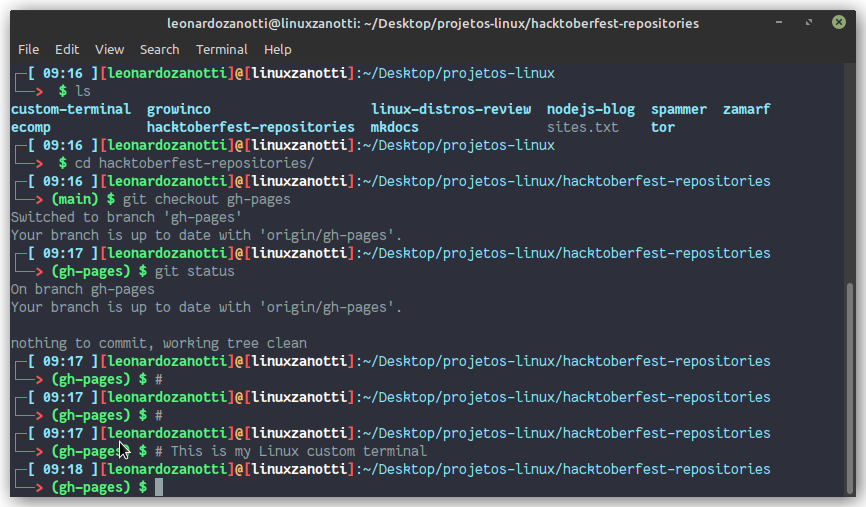
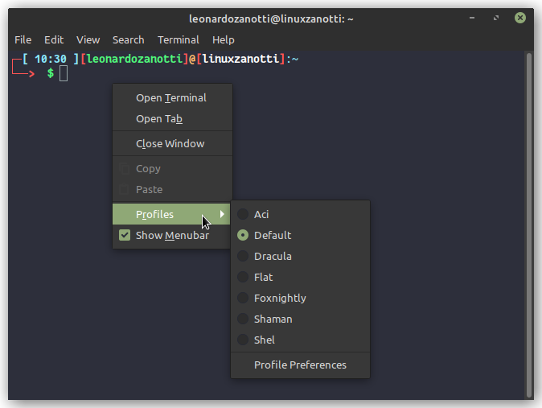

# Custom terminal
This is a guide to how you can to customize your linux terminal.

## Basic knowledge about custom terminal
The linux terminal, at least the Mint terminal, has a bash configuration file called `.bashrc`, located in the ~ directory (user directory). This file defines some commands of the terminal and the style of it. So if you need to run some big command frequently, you can just create an alias in this file to make your life easier.

About the style of terminal, this file has a PS1 variable that defines the prompt shell line style (the command line style).
```bash
$ echo "$PS1"
# output: \[\e]0;\u@\h: \w\a\]${debian_chroot:+($debian_chroot)}\u@\h:\w\$
# \u is the user name
# \h is the hostname
# \w is the current directory
# \$ displays '#' if UID is 0 (root), otherwise, displays '$'
```
If you want, you can save this variable before customize your terminal, so you can restore it using something like:
```bash
$ oldps1="$PS1"
$ echo "$oldps1" 	# output: \[\e]0;\u@\h: \w\a\]${debian_chroot:+($debian_chroot)}\u@\h:\w\$
$ PS1="$oldps1"		# restores the configuration
```

You can try some configurations using `$ export PS1="config here"`. So we do:
```bash
$ export PS1="[\\u@\\H \\W \\@]\\$ "
# \@ displays the time in 12-hour format
```
Then we have:


To use colors, we should use shell colors, that are the following:

| Shell code | Color  |
| -----------|:------:|
| 0;30       | Black  |
| 0;34       | Blue   |
| 0;32       | Green  |
| 0;36       | Cyan   |
| 0;31       | Red 	  |
| 0;35       | Purple |
| 0;33       | Brown  |

To do this, we use `\e[` to start a color and `\e[m` to finish the use of the color. You can get a full list of colors and ways to use this colors [here](https://gist.github.com/vratiu/9780109) and [here](https://www.vivaolinux.com.br/dica/Shell-script-com-texto-colorido).

```bash
# Coloring the line
$ export PS1="\e[0;32m[\u@\h \W]\$ \e[m "
```


## Editing the .bashrc file
To permanently change the style of the prompt line, you should edit the `.bashrc` file with the PS1 configuration you choose. My `.bashrc` file is in this repo, so if you want you can just replace yours with it. My PS1 in this file looks like this:
```bash
#===========================================
# Color variables
#===========================================
NONE="\[\033[0m\]" # No color

## Colors
K="\[\033[0;30m\]" # Black
R="\[\033[0;31m\]" # Red
G="\[\033[0;32m\]" # Gree
Y="\[\033[0;33m\]" # Yellow
B="\[\033[0;34m\]" # Blue
M="\[\033[0;35m\]" # Magenta
C="\[\033[0;36m\]" # Cyan
W="\[\033[0;37m\]" # White

## Bold colors
BK="\[\033[1;30m\]" # Bold+Black
BR="\[\033[1;31m\]" # Bold+Red
BG="\[\033[1;32m\]" # Bold+Green
BY="\[\033[1;33m\]" # Bold+Yellow
BB="\[\033[1;34m\]" # Bold+Blue
BM="\[\033[1;35m\]" # Bold+Magenta
BC="\[\033[1;36m\]" # Bold+Cyan
BW="\[\033[1;37m\]" # Bold+White

## Background colors
BGK="\[\033[40m\]" # Black
BGR="\[\033[41m\]" # Red
BGG="\[\033[42m\]" # Green
BGY="\[\033[43m\]" # Yellow
BGB="\[\033[44m\]" # Blue
BGM="\[\033[45m\]" # Magenta
BGC="\[\033[46m\]" # Cyan
BGW="\[\033[47m\]" # White

#=============================================
# User configurations
#=============================================

## function to get the currently branch with git
git_branch() {
  git branch 2> /dev/null | sed -e '/^[^*]/d' -e 's/* \(.*\)/(\1)/'
}

if [ $UID -eq "0" ]; then
    ## Terminal if root
    PS1="$G┌─[$BR\u$G]$BY@$G[$BW${HOSTNAME%%.*}$G]$B:\w\n$G└──>$BR \\$ $NONE"
else
    ## Terminal if not root
    PS1="$BR┌─$BB[ \@]$BR[$BG\u$BR]$BY@$BR[$BW${HOSTNAME%%.*}$BR]$B:\w\n$BR└──>$BG \$(git_branch) \\$ $NONE"
fi

## PS1 examples
# PS1="\e[01;31m┌─[\e[01;35m\u\e[01;31m]──[\e[00;37m${HOSTNAME%%.*}\e[01;32m]:\w$\e[01;31m\n\e[01;31m└──\e[01;36m>>\e[00m"
# PS1='\[\e[m\n\e[1;30m\][$:$PPID \j:\!\[\e[1;30m\]]\[\e[0;36m\] \T \d \[\e[1;30m\][\[\e[1;34m\]\u@\H\[\e[1;30m\]:\[\e[0;37m\]${SSH_TTY} \[\e[0;32m\]+${SHLVL}\[\e[1;30m\]] \[\e[1;37m\]\w\[\e[0;37m\] \n($SHLVL:\!)\$ '}
# PS1="\e[01;31m┌─[\e[01;35m\u\e[01;31m]──[\e[00;37m${HOSTNAME%%.*}\e[01;32m]:\w$\e[01;31m\n\e[01;31m└──\e[01;36m>>\e[00m"
# PS1="┌─[\[\e[34m\]\h\[\e[0m\]][\[\e[32m\]\w\[\e[0m\]]\n└─╼ "
# PS1='[\u@\h \W]\$ '

## old PS1
# if [ "$color_prompt" = yes ]; then
#     PS1='${debian_chroot:+($debian_chroot)}\[\033[01;32m\]\u@\h\[\033[00m\]:\[\033[01;34m\]\w\[\033[00m\]\$ '
# else
#     PS1='${debian_chroot:+($debian_chroot)}\u@\h:\w\$ '
# fi
# unset color_prompt force_color_prompt
```
Im using the Dracula theme (i will talk about this below), but this configurations changes your terminal to something like this:


## Custom fonts
You can install custom fonts to your terminal and then select this in your profile. Im using Fantasque Sans, which you can install in Debian and derivades with:
```bash
$ sudo apt install fonts-fantasque-sans
```

## Theme of the terminal
To customize your terminal theme, you can use the [Gogh](https://mayccoll.github.io/Gogh/) tool. You just need to run:
```bash
$ bash -c  "$(wget -qO- https://git.io/vQgMr)"
```
And then choose the themes you want to download. Finally, just change the theme in your profile in the terminal (usually a right click on the terminal shows the options for you, if not, you probably will find this in the terminal top menu).



## Other options
You always can search for some theme in the internet. The Dracula theme if my favorite, so (here is a page if you want to download this theme)[https://draculatheme.com/terminal], just follow the guide and you will get something like this:


You can find more themes with [Oh My BASH](https://ohmybash.nntoan.com/), just see the page and choose some themes you want.


## References
Thanks to Vivek Gite for (his article)[https://www.cyberciti.biz/faq/bash-shell-change-the-color-of-my-shell-prompt-under-linux-or-unix/], very cool!
And thanks to [this youtube video](https://www.youtube.com/watch?v=oJrxue3PjaY) from O Pinguim Criativo, so helpful.

## LeonardoZanotti